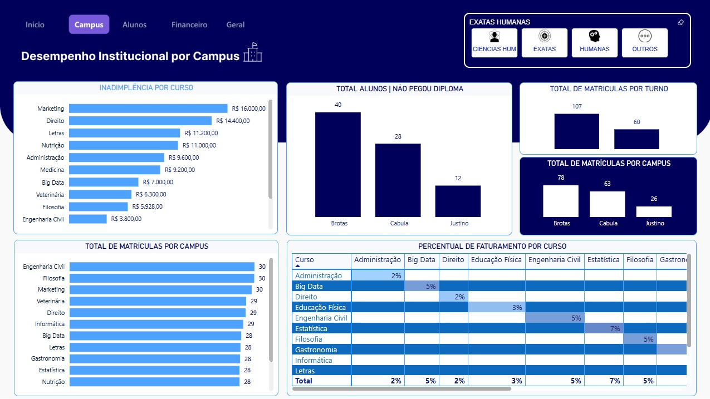
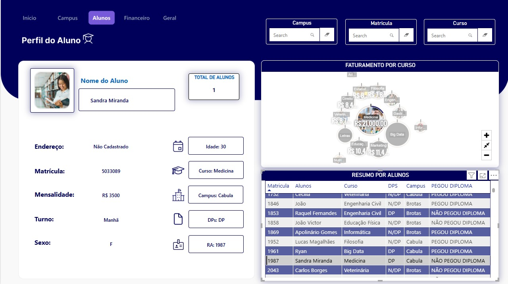
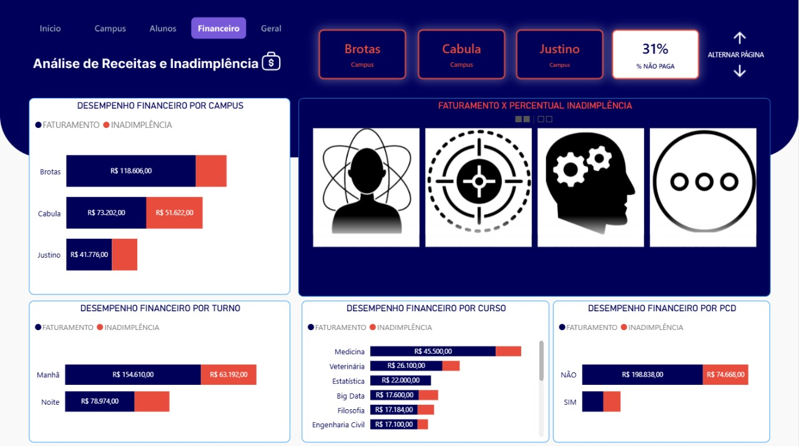
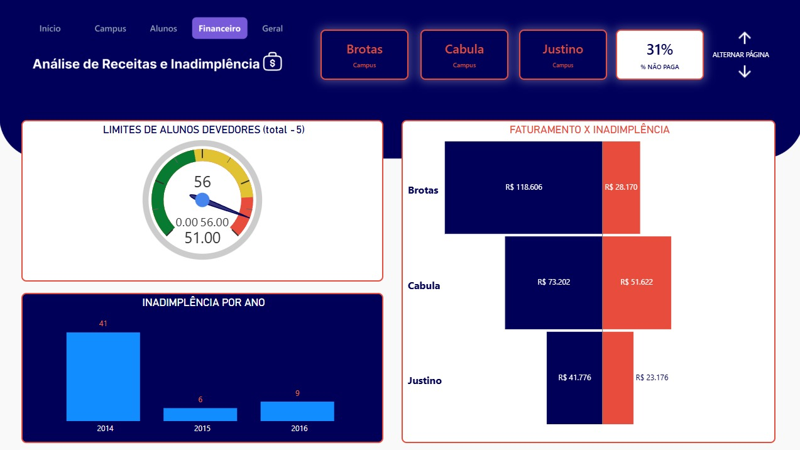
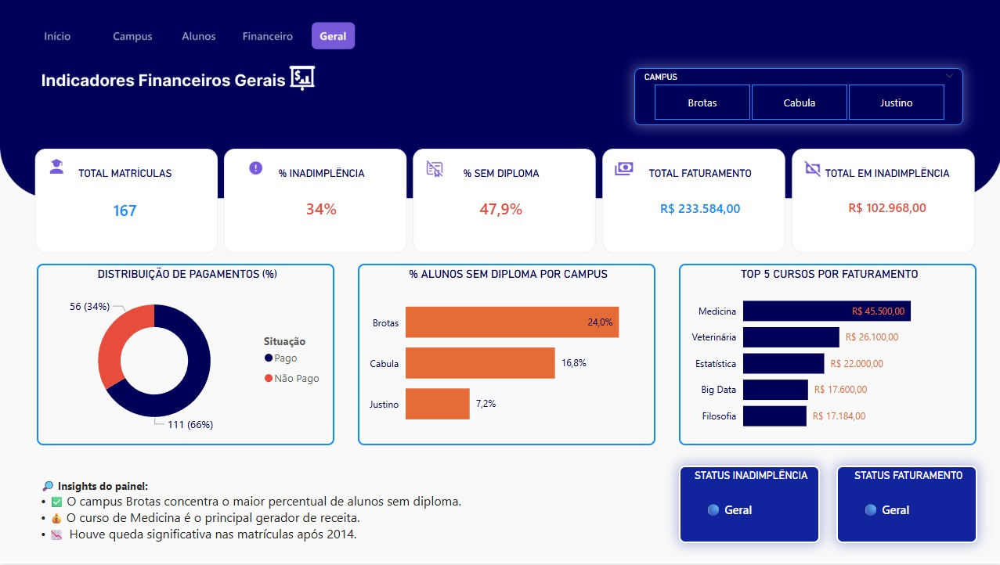

# 🎓 Dashboard Universitário – Power BI

Este projeto apresenta um **Dashboard Universitário desenvolvido no Power BI**, com foco na **análise de alunos, inadimplência, faturamento e desempenho institucional por campus**.  
O objetivo do projeto é transformar dados acadêmicos em **informação estratégica para tomada de decisão**.

---

## 🖼️ Visual do Projeto

### 📌 Capa do Dashboard

### 🏫 Página Campus – Desempenho Institucional

### 👩‍🎓 Página Alunos – Perfil e Faturamento por Curso

### 💰 Página Financeiro – Receitas x Inadimplência

### 💰 Página Financeiro – Receitas x Inadimplência (Alternada)

### 📊 Página Geral – Indicadores Financeiros

---

## 📊 Indicadores Analisados

- ✅ Total de Matrículas  
- ✅ Percentual de Inadimplência  
- ✅ Percentual de Alunos Sem Diploma  
- ✅ Total de Faturamento  
- ✅ Total em Inadimplência  
- ✅ Top 5 Cursos por Faturamento  
- ✅ Distribuição de Pagamentos (Pago x Não Pago)  
- ✅ Inadimplência por Ano  
- ✅ Desempenho por Campus  
- ✅ Perfil Individual do Aluno  

---

## 🛠️ Tecnologias Utilizadas

- **Power BI**
- **Power Query (ETL)**
- **DAX**
- **Modelagem de Dados (Fato x Dimensão)**

---

## 📚 Principais Aprendizados Aplicados no Projeto

Durante o desenvolvimento deste dashboard, foram consolidados conceitos fundamentais de análise de dados:

### ✅ Modelagem de Dados
- Estruturação utilizando **Tabelas Fato e Tabelas Dimensão**
- Relacionamentos corretos para garantir filtros consistentes nos visuais

### ✅ ETL com Power Query
- Limpeza e padronização dos dados
- Tratamento de valores nulos
- Criação de colunas auxiliares
- Tipagem correta de dados

### ✅ DAX Avançado
- Uso de **medidas com variáveis (VAR)** para:
  - Melhorar performance
  - Aumentar a legibilidade das fórmulas
- Criação de:
  - Medidas de faturamento
  - Medidas de inadimplência
  - Indicadores percentuais
  - Medidas de status dinâmico (Saudável, Em Alerta, Crítico)

### ✅ Interatividade
- Uso de **segmentações (slicers) por campus**
- Interação entre gráficos e indicadores
- Navegação entre páginas por botões

---

## 🎯 Objetivo do Projeto

Demonstrar na prática:
- Capacidade de análise de dados educacionais
- Construção de dashboards profissionais
- Aplicação de ETL
- Uso eficiente de DAX
- Visual analítico com foco em negócio

---

## 🚀 Status do Projeto

✅ Concluído  
📌 Projeto integrante de portfólio profissional em **Power BI e Data Analysis**

---

## 👩🏾‍💻 Autora

Projeto desenvolvido por **Clarisse Maurila**  
📊 Foco em **Data Analysis | Power BI | SQL | ETL**

---

⭐ Se você gostou deste projeto, não esqueça de deixar uma estrela no repositório!
